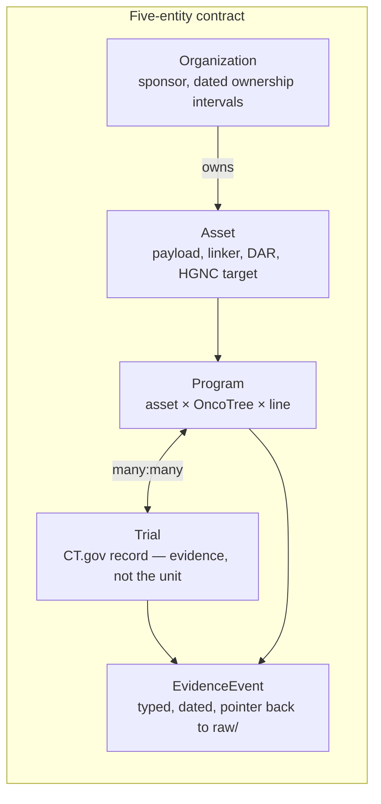
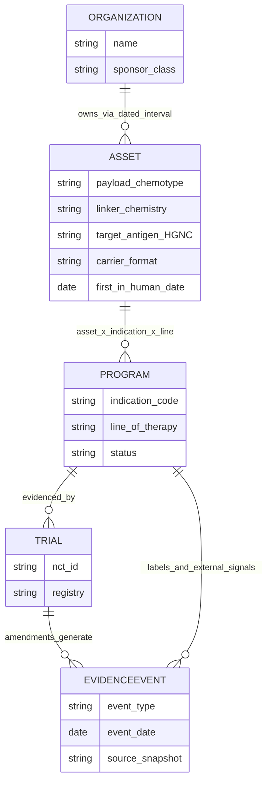
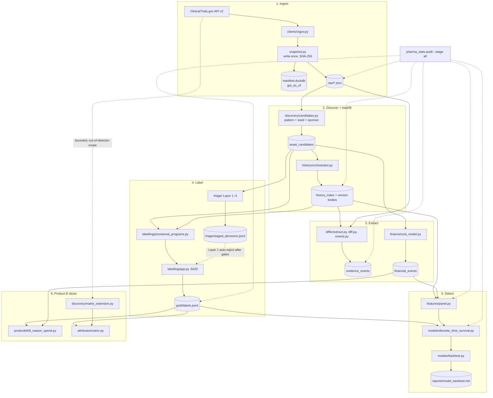

# pharma_statistics

Detect silently-discontinued antibody-drug conjugate (ADC) oncology programs
from public data. Scope is locked: **ADCs, solid tumours, industry sponsors,
2012–present.** DuckDB over Parquet/JSON on a laptop; no Postgres, no cloud.

Project conventions live in [`CLAUDE.md`](CLAUDE.md). The five-entity model
(asset, program, trial, evidence event, organization) is specified there.
Decision records live in [`docs/decisions/`](docs/decisions/). An older
as-built snapshot with corpus counts (2026-08-25) is
[`diagrams/diagram.md`](diagrams/diagram.md) — numbers there drift; this
README is the current map.

## What is built

| Layer | Status |
|---|---|
| Immutable snapshot store (`raw/` + DuckDB manifest, `get_as_of`) | done |
| ClinicalTrials.gov v2 client + undocumented `/api/int` history | done |
| ADC candidate discovery (pattern / seed / sponsor union) | done |
| History index + resumable, priority-ordered version backfill | done |
| Schema guard on the undocumented history API | done |
| Controlled-vocab normalisation (payload, target, indication, line) | **not started** |
| Five-entity warehouse (Asset / Program / Trial / EvidenceEvent / Org) | **not started** |
| EvidenceEvent extraction from trial amendments | **done, not yet wired into the labelling app** |
| Labelling UI + gold labels | **provisional v0** — one program per candidate asset (no indication/line split), silence score is a hand-built heuristic, event timeline is untyped amendment history |
| Gate 1/2 triage (deterministic Layer 1 + batched Layer 2/3) | **done, Layer 2/3 not auto-committed** until the blind validation gate passes |
| Money layer (Product C): synthetic cost index, conviction ratio, `financial_events` | done |
| Money-layer feature panel (`conviction_ratio`, `estimated_cumulative_spend`) + `audit/leakage.md` | done — `conviction_ratio` is consumed by the `dead` hazard (complete-case; never imputed) |
| Product B (sourcing screener): B0 (asset attributes) + B1 (kill reason vs. spend) + B5 (opportunity matrix) | **partial** — B2–B4, B6–B7 not started |
| Matrix-only universe extension (2000–2012, haematological indications) | done — feeds the matrix only, never gold or the detector |
| Corpus and label statistics | done |
| Program-status detection / silent-kill backtest | **done, narrow result** — the `dead` cause-specific hazard beats the silence-score heuristic only at a thin, high-threshold operating point; see `reports/leading_indicator_refit.md` |

The ingest → discover → backfill spine works, and a first end-to-end
detector (features → hazard model → time-cut backtest) runs too. Its
advantage over the silence-score heuristic is thin, so “works” means
“runs end to end and is honestly evaluated,” not “reliably catches silent
kills yet.”

## Architecture

The five-entity model (full detail in [`CLAUDE.md`](CLAUDE.md)) is the
unit-of-analysis contract. **Program** (asset × indication ×
line-of-therapy) is what gets analysed, never a trial in isolation.



**Not yet built as a real warehouse.** There is no unified
Asset/Program/Trial/EvidenceEvent/Organization schema with foreign keys.
Today the data lives in narrower DuckDB tables and JSONL:

| Store | What it actually is |
|---|---|
| `raw/` | Immutable fetch snapshots. Ground truth. Never mutate. |
| `data/manifest.duckdb` | Derived index; rebuild with `rebuild_manifest()` |
| `asset_candidates` | Discovery universe |
| `history_index` + versioned `raw/` bodies | Trial history |
| `evidence_events` | Differ output: typed, signed, dated amendments |
| `financial_events` | Synthetic cost index + conviction ratio |
| `provisional_programs` | Stand-in Program view, keyed by candidate asset only |
| `gold/labels.jsonl` | Append-only program-status judgements. A correction is a new line. |
| `triage/staged_decisions.jsonl` | Auto Gate 1/2 proposals. Not gold until a human bulk-accepts. |



`PROGRAM.indication_code` is still `"UNSPECIFIED"` in the provisional
view — OncoTree split is not built.

## Pipeline

Solid arrows are data dependencies. Dashed arrows are the audit harness
checking a stage, not feeding the next one. The matrix-extension pass is
drawn off to the side on purpose: it never writes gold or trains the
hazard.



`discovery/matrix_extension.py` is a separate CT.gov pass for programs
the locked scope excludes (pre-2012 start dates, haematological
indications). It classifies them with `labelling/dead_historical.py`
instead of a gold label, and only ever feeds the opportunity matrix.
See [`docs/decisions/0008-dead-historical-status.md`](docs/decisions/0008-dead-historical-status.md).

## Repo layout

- `raw/` — immutable snapshots. Never edit by hand. Gitignored.
- `gold/` — append-only JSONL labels. Corrections are new lines.
- `data/` — derived DuckDB + session JSON. Rebuildable; `*.duckdb` gitignored.
- `triage/` — staged auto-decisions, not gold.
- `reports/` — generated audit/coverage reports. Most `*.md` gitignored.
- `docs/decisions/` — numbered decision records.
- `src/pharma_stats/` — library (`snapshot`, `clients`, `discovery`,
  `history`, `differ`, `labelling`, `triage`, `finance`, `features`,
  `models`, `attributes`, `productb`, `audit`).
- `scripts/` — one-shot / periodically-rerun entry points.
- `audit/leakage.md` — hand-authored knowability-date register.

## Setup

```bash
python3 -m venv .venv
source .venv/bin/activate
pip install -e ".[dev]"
```

## Tests (no network, mock data)

```bash
pytest
```

That runs the snapshot store, CT.gov client (mocked HTTP), schema guard,
history index, backfill orchestrator, discovery clustering, and an
end-to-end mock pipeline (snapshots → candidates → warehouse → backfill).

## Live crawl (optional, hits ClinicalTrials.gov)

```bash
# smoke: a handful of studies through the snapshot store
python scripts/fetch_ctgov_sample.py 10

# candidate universe → data/warehouse.duckdb + reports/
python scripts/build_candidate_universe.py

# resumable history backfill (Ctrl-C is safe; rerun to resume)
python scripts/run_backfill.py --signal-labels recommended --max-seconds 3600
```

`raw/` and `data/*.duckdb` are local-only (see `.gitignore`). The manifest
is derived:

```bash
python -c "from pharma_stats.snapshot import rebuild_manifest; print(rebuild_manifest())"
```

Set `CTGOV_CONTACT` to put a contact address in the crawler User-Agent.

## Labelling app (provisional v0)

```bash
python scripts/run_labelling_app.py            # opens http://127.0.0.1:8420
python scripts/run_labelling_app.py --rebuild  # recompute the provisional program view first
```

The real five-entity warehouse and controlled-vocab normalisation don't
exist yet, so this reads a **provisional** program view built straight
from `asset_candidates` + raw CT.gov snapshots: one provisional program
per candidate asset (`indication_code="UNSPECIFIED"`, no line-of-therapy
split), scored with a hand-built silence heuristic — not the project's
eventual model. See `pharma_stats/labelling/provisional_programs.py`.

Labels are append-only JSONL at `gold/labels.jsonl`. Session/queue state
(stratified by score band × archetype, ~10% silently re-served for
self-consistency) persists to `data/labelling_session.json` and survives
restarts; losing that file costs queue position, never a label.

**History-coverage guard.** Every provisional program carries a
`history_coverage` field (`full` / `partial` / `none`), computed from
`history_index` + `backfill_queue` — not the timeline itself, since a
program with zero indexed history and a program that was genuinely never
amended render the same empty timeline. `/api/next` refuses to serve
anything short of `full`; `validate_label_payload` refuses to save a
label whose serve-time coverage wasn't `full`; and
`history_coverage_at_serve_time` is stamped onto every label so
incomplete-evidence labels can be found later. The coverage badge is
shown even in blind mode — it is a data-quality fact, not a model
opinion.

## Gate 1/2 triage

```bash
python scripts/run_triage_pipeline.py --dry-run
python scripts/apply_triage_to_queue.py          # Layer 1 committable rejections → gold
python scripts/run_triage_pipeline.py --full     # Layer 2 + 3 into staging; needs ANTHROPIC_API_KEY
```

Layer 1 is deterministic and may write `decided_by=auto` gold after the
MeSH / agreement gates. Layer 2/3 land in `triage/staged_decisions.jsonl`
and stay out of the labelling skip-path until `validation.check_gate`
passes. See `pharma_stats.triage`.

## Differ (EvidenceEvent extraction)

```bash
python scripts/run_differ.py   # warehouse.duckdb::evidence_events + reports/differ_noise_floor.md
```

Local computation only — diffs every pair of adjacent fetched version
bodies (`raw/` + `history_index`), no network. Rules, non-negotiable:

- Never diffs a date/enrollment field across an ESTIMATED → ACTUAL
  boundary as a plan change — emits a `*_finalized` event instead.
- `event_date` is always the *to-version*'s `posted_date` (when CT.gov
  made the change public) — never `submitted_date`. That is the
  knowability date the backtest depends on.
- Enrollment and completion-date changes carry a `direction`
  (`increased` / `decreased`, `pushed_later` / `pulled_earlier`).

The labelling app timeline still shows untyped amendment history; the
differ is not wired into it yet.

## Money layer + feature panel

```bash
python scripts/build_financial_layer_cost_index.py   # writes financial_events
python scripts/report_kill_reason_spend.py            # reports/kill_reason_spend.md
```

`pharma_stats.finance.panel` turns monthly `synthetic_cost_index_monthly`
/ `conviction_ratio_monthly` events into a per-program, per-month panel.
Knowability dates are registered in `audit/leakage.md` and checked by the
audit `features` stage. `productb.kill_reason_spend` (B1) resolves both
features as of each `dead_confirmed` program's `label_evidence_date` —
per [`docs/decisions/0004-spend-is-not-quality.md`](docs/decisions/0004-spend-is-not-quality.md),
read descriptively, never causally.

`features.panel` wires the exact-month `conviction_ratio` into the
program × month panel. `models.discrete_time_survival` derives
`log_conviction_ratio` for the `dead` hazard alongside `log_cost_index`.
A missing conviction ratio (no usable peer group that month) is
complete-case dropped from the fit, never imputed as 0 or 1.

## Silent-kill backtest

```bash
python scripts/run_model_backtest.py                 # reports/model_backtest.md
python scripts/run_leading_indicator_refit.py        # reports/leading_indicator_refit.md
```

Time-cut: train on the panel truncated at `--cutoff` (default
`2022-01-01`), evaluate after. The `dead` cause-specific hazard is the
only outcome with enough events to read a coefficient. The leading-
indicator refit reports the full lead-time distribution vs. the silence
heuristic at matched operating points — that is the honest “does this
beat the heuristic?” number, not a single median.

## Matrix-only universe extension (2000–2012, haematological indications)

```bash
python scripts/build_matrix_extension_universe.py   # data/matrix_extension_programs.json
python scripts/build_adc_indication_table.py        # folds it into the coarse matrix view
```

`discovery.matrix_extension` discovers ADC trials the locked scope
excludes on exactly two axes — pre-2012 start dates and haematological
indications — industry sponsors and ADC-only otherwise unchanged.
Outcomes use `labelling.dead_historical`, not manual labelling. This
cohort never enters `gold/labels.jsonl` or the detector's training data.

## Corpus and label statistics

```bash
python scripts/report_corpus_statistics.py   # reports/corpus_statistics.md
python scripts/report_label_statistics.py    # reports/label_statistics.md
```

`corpus_statistics` describes the whole provisional-program corpus
unweighted — it *is* the population.

`label_statistics` describes `gold/labels.jsonl`, which **is** a sample
(stratified by silence-score band × archetype). Population-level numbers
are inverse-probability-weighted by stratum; empty labelled strata raise
`InsufficientStratumCoverageError` rather than silently omitting them.
Confidence intervals resample **sponsors**, not programs (cluster
bootstrap).

It also reports stated-vs-true kill-reason divergence: how often CT.gov
`why_stopped` text, run through a small keyword classifier, would
disagree with the labeller's full-evidence judgement.

## Audit harness

```bash
python -m pharma_stats.audit --stage all       # every stage, timestamped report to audit/
python -m pharma_stats.audit --stage gold_set  # just one stage
```

Verifies each built pipeline stage actually ran, populated correctly,
and converged: raw/manifest provenance (including a probe that
`get_as_of` returns the historically-correct snapshot, not the latest),
discovery coverage, history-index integrity, backfill drain state, the
differ's noise floor / negative control / ESTIMATED–ACTUAL invariant,
the gold set (stratum coverage, `dead_confirmed` date invariant,
self-consistency, label-sufficiency bootstrap), and the feature-panel
leakage register. Levels are FAIL / WARN / INFO — exit code is non-zero
on any FAIL.

`universe`'s “unreviewed candidates” check is a **gate**: a FAIL there
halts `--stage all` before any downstream stage.

Normalisation (the five-entity warehouse) still reports an honest
“not built” INFO rather than being silently omitted. Features and model
stages run against what exists today.
